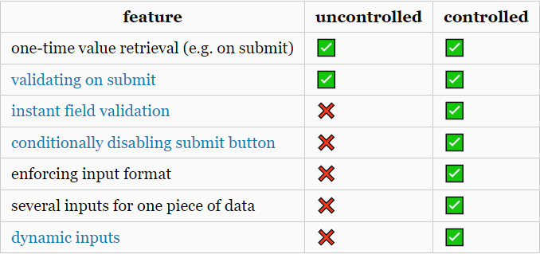

# TIL - 20220617

## Controlled Component vs Uncontrolled Component

코드숨 과제를 진행하면서 처음 작성했던 코드를 `useRef()`를 사용한 코드로 수정하려다가 `useRef()`가 어느 케이스에 사용되는지 정확히 알고 있는가란 질문을 받았다.

처음 작성했던 코드는 다음과 같이 상태를 이용해서 `input` 엘리먼트의 `value`를 관리하던 코드다.

```javascript
// Controlled Component
const TodoForm = ({ onSubmit }) => {
  const [title, setTitle] = useState('');

  const handleChange = (e) => {
    setTitle(e.target.value);
  };

  const handleSubmit = (e) => {
    e.preventDefault();
    onSubmit(todoTitle);
    setTitle('');
  };

  return (
    <form onSubmit={handleSubmit}>
      <input type="text" value={title} onChange={handleChange} />
      <button type="submit">추가</button>
    </form>
  );
};
```

위의 코드를 다음과 같이 `useRef()`를 사용한 코드로 바꾸려고 했었다.

```javascript
// Uncontrolled Component
const TodoForm = ({ onSubmit }) => {
  const inputRef = useRef();

  const handleSubmit = (e) => {
    e.preventDefault();
    onSubmit(inputRef.current.value);
    e.target.reset();
  };

  return (
    <form onSubmit={handleSubmit}>
      <input ref={inputRef} type="text" />
      <button type="submit">추가</button>
    </form>
  );
};
```

두 방법 중에 어느 방법이 나은지 [리액트 공식 문서](https://ko.reactjs.org/docs/uncontrolled-components.html)를 보면 **Controlled Component**, 즉 처음의 방법을 권장한다. 그 이유에 대해서는 다음 글이 많은 도움이 됐다.

[https://goshacmd.com/controlled-vs-uncontrolled-inputs-react/](https://goshacmd.com/controlled-vs-uncontrolled-inputs-react/)

핵심만 정리하자면,

1.  내가 작성한 코드에서 처음에 title이 ''(빈 문자열) 일 때,
2.  사용자가 a를 입력하면, handleChange가 호출되면서 a를 얻고
3.  setTitle을 호출함으로써 리렌더링이 일어난다.

이건 가장 일반적인 **React Way**라 할 수 있다.

이런 흐름을 통해 상태와 UI는 항상 동기화되는데, 이는 입력 값의 변화에 즉각 반응할 수 있다는 의미로, 입력과 동시에 올바른 값인지 검증해서 피드백을 주거나, 입력값이 비었다면 버튼을 비활성화하는 등의 처리를 할 수 있다. 표로 정리하면 다음과 같은 차이가 있다.



결론은 매우 간단한 기능을 만드는 특별한 경우를 제외하고는 **Controlled Component**를 쓰는 게 더 낫다.

## 간단한 회고

원래는 개발할 때 오늘처럼 애매한 부분이 나와도 대충 생각하고 넘겼는데, 코드숨과 TIL 작성을 시작하면서 그 이유에 대해 찾아보려고 노력하고 있다. 순간에 그치는 것이 아니라 습관이 되도록 노력하자.
