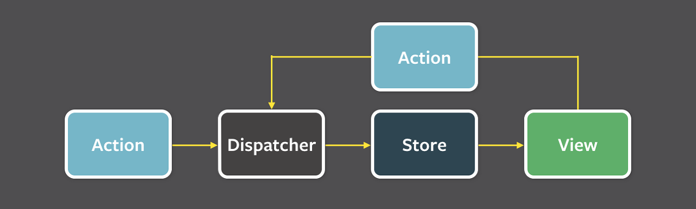

# TIL - 20220627

## Flux Architecture

Flux Architecture는 그동안 어렴풋이 알고 있었지만, [공식 문서](https://facebook.github.io/flux/docs/in-depth-overview/)는 처음 읽어봤다. 다음 사진은 Flux Architecture를 표현하는 대표적인 사진이다.

가장 큰 특징을 정리하면 다음과 같다.

- 단방향 데이터 Flow다.
- Action이 Dispatcher를 통해 Store에 전달되고, 그 Store의 상태에 따라 View가 변화한다.
- 대부분의 Action은 View에서 사용자와의 상호작용을 통해 발생한다.

## Redux

Redux는 Flux Architecture의 구현체며, 상태 관리라는 하나의 관심사를 React에서 분리해주는 역할을 한다.

## TDD

TDD를 이용해서 코드숨 과제를 진행했다. 할 일 목록을 관리하는 reducer에 대해 개발했는데 TDD로 개발하면서 느낀 가장 큰 장점은 내가 기능을 올바르게 만들었는지를 바로바로 피드백을 받을 수 있다는 것이었다. 특히 예외 처리와 관련된 부분을 보다 꼼꼼히 확인할 수 있기 때문에 내 코드가 올바르게 동작할 거라는 확신을 가질 수 있다는 것도 좋았다.
