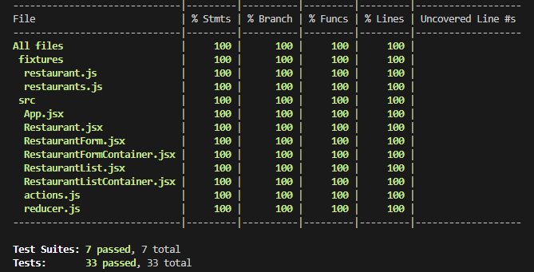

# TIL - 20220701

## 코드숨

오늘도 코드숨 4주 차 두 번째 과제인 **레스토랑 정보 확인 및 예약 시스템 구축하기**를 진행했다. 이 과제의 목표는 레스토랑의 이름, 분류, 주소를 입력받고, 추가 버튼을 누르면 레스토랑 목록에 추가해 사용자에게 보여주는 것이다.

오늘은 어제 만들었던 리덕스 관련 코드를 리팩토링하고, 그것을 기반으로 컴포넌트를 추가했다. 특히 오늘 리덕스 관련 코드들을 리팽토링 하면서 TDD의 장점을 체감할 수 있었다.

사용자가 입력한 값을 `nameInput`, `typeInput`, `addressInput`이라는 각각의 변수로 관리하던 것을 `restaurant`라는 하나의 객체로 묶어서 관리하도록 리팩토링 작업을 했는데, 이미 만들어진 테스트가 지속적으로 피드백을 해주니 혹시나 잘못 수정하지 않을까 하는 걱정이 없었고, 테스트를 먼저 수정하면 실제 코드에서도 어느 부분을 수정해야 하는지 바로 알 수 있었기에 보다 안전하고, 빠르게 리팽토링을 할 수 있었다.

또한 지난 과제까지는 이미 만들어진 컴포넌트에 테스트를 추가하거나 수정했었는데, 오늘 처음으로 이미 작성된 컴포넌트가 전혀 없는 상황에서 처음부터 TDD로 컴포넌트를 개발했다. 테스트 코드를 따로 작성하는 게 좀 귀찮긴 했지만, 컴포넌트의 역할을 보다 명확하게 구분하고, 안전하게 개발할 수 있다는 점이 좋았다.

테스트 코드 작성이 귀찮은 것이 아닌 당연한 것이 될 때까지 더욱더 정진해야겠다.
