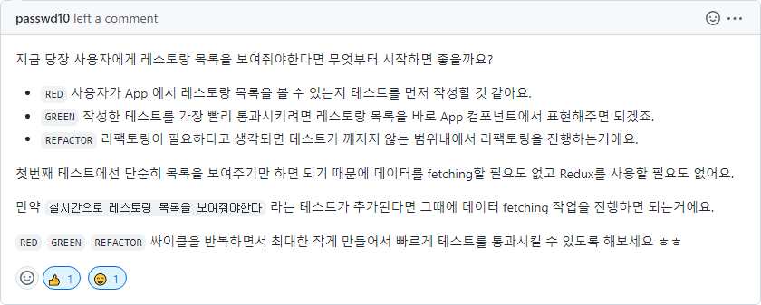

# TIL - 20220706

## script, link

오늘은 HTML에서 스크립트나 리소스를 불러올 때 사용하는 태그의 속성들에 대해 공부했다.

- `<script>`를 비동기적으로 로딩하기 위한 속성으로 `async`, `defer`가 있다.
- `<link>`에서 리소스를 빨리 가져오기 위한 속성으로 `preload`, `prefetch`, `preconnect`가 있다.

이 속성들의 기능은 제각각이지만 공통적인 목표는 성능의 향상, 즉 사용자가 원하는 데이터를 얼마나 빨리 보여주느냐가 관건이다.

그동안은 "그냥 `<script>`에서는 `defer` 쓰면 되지"와 같이 단편적으로만 생각했는데, 각 속성은 저마다의 활용 방법이 있고, 별생각 없이 남용하면 오히려 성능 저하를 일으킬 수 있다는 것을 깨달았다. 앞으로도 시간이 날 때마다 무심코 썼던 기능들을 한 번씩 돌아보면 좋을 것 같다.

## 코드숨 TDD

지난 TIL에서 `App`처럼 큰 컴포넌트에서 TDD를 어떻게 시작하고, 커밋을 어떻게 나눠야 할지 모른다고 했었는데 그에 대해 트레이너님이 팁을 주셨다.

이 설명을 보니 전체 프로그램의 기능을 알고 있는 입장에서 처음부터 `App`의 역할을 너무 크게 생각했던 게 아닌가 싶다. 내일부터 최대한 작은 기능부터 차근히 TDD로 개발하는 연습을 해봐야겠다.
