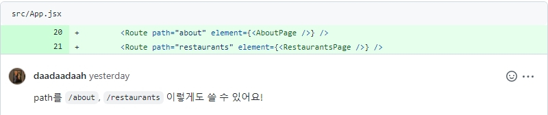
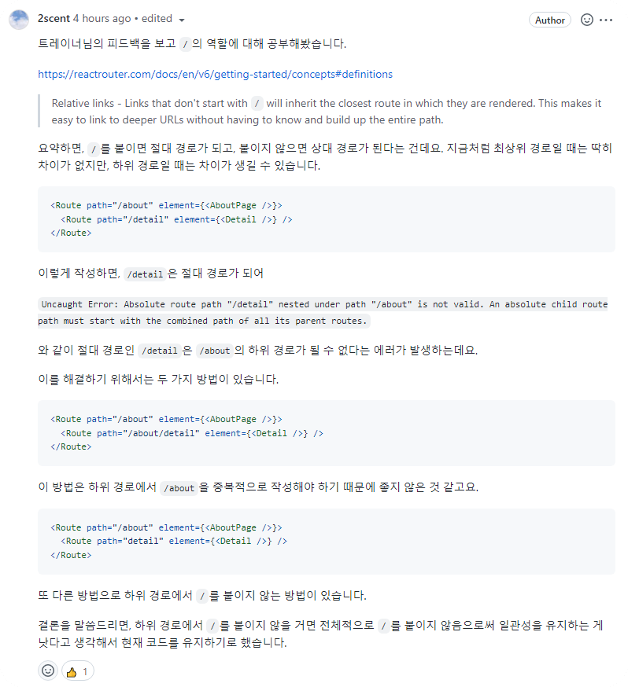

# TIL - 20220713

## 코딩 테스트

코딩 테스트를 위해 JavaScript 기반으로 다음과 같은 자료구조를 공부했다.

- Array
- List
- Stack
- Queue

자료구조는 예전에 C언어로 잠깐 공부해 보고, 최근에는 Python으로만 공부했었는데 JavaScript로 공부해 보니 좀 새로웠다. 주력 언어라 할 수 있는 JavaScript로 기본적인 자료구조를 구현하는 게 어색하다는 점에서 그동안 소홀했다는 것을 느꼈다. JavaScript로 코딩 테스트를 통과하려면 꾸준한 학습이 필요해 보인다.

## React Router - Relative links

`react-router-dom`을 이용해서 라우팅 하는 코드에 대해서 다음과 같은 피드백을 받았다.

공식 사이트에 나와 있는 방법을 그냥 따라 썼던 건데 트레이너님의 피드백을 보고 `/`의 정확한 역할이 무엇인지 궁금해졌다. 그에 대해 학습한 내용은 다음과 같다.

[https://github.com/CodeSoom/react-week6-assignment-1/pull/97#discussion_r919967236](https://github.com/CodeSoom/react-week6-assignment-1/pull/97#discussion_r919967236)

어떤 기술을 사용하든 그 기술을 사용하는 나름의 이유가 있어야 한다는 것을 또 한 번 느낀다.
