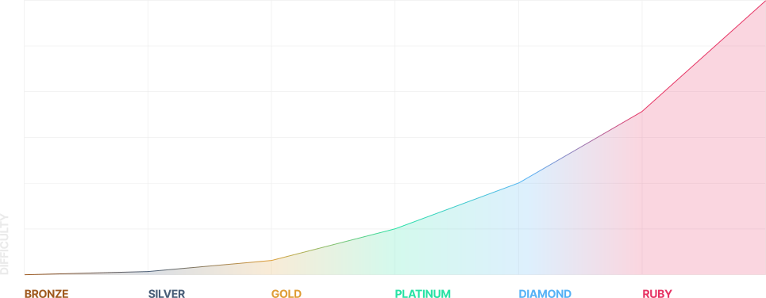
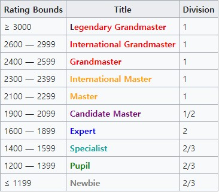
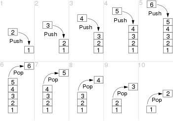
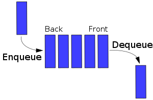

# 보통의 취준생을 위한 코딩 테스트 with 파이썬

> 본 문서는 [보통의 취준생을 위한 코딩 테스트 with 파이썬](https://roadbook.co.kr/267)을 읽고 제 주관대로 정리한 글입니다.

---

# 제1장 - 코딩 테스트 준비, 6개월이면 충분하다

> <백준> 플래티넘 5 or <코드포스> 파란색 랭크를 달성하면 대부분 기업의 코딩 테스트를 통과할 수 있다.

## <백준> 난이도 등급



## <코드포스> 계정 랭크



## 저자의 실수

1. 자신의 실력보다 어려운 문제에 대한 도전을 두려워했다.
2. 문제를 보고 정답을 모를 때 해답을 보며 자신의 것으로 만들지 않았다.
3. 풀어본 문제에 대하여 사색의 시간을 갖지 않았다.

- 핵심 알고리즘 10개를 기반으로 <백준>, solved.ac, <코드포스> 등을 통해 문제 해결 능력을 기르자
- 복기를 통해 제대로 풀지 못한 문제는 해답을 보며 정확하게 내 것으로 만들도록 노력하자
- 아는 문제라도 왜 그 답이 맞는지 증명할 수 있어야 하며, 더 나은 방법은 없는지 한 번 더 생각해보자

# 제2장 - 코딩 테스트의 주적, 시간 복잡도

> 코딩 테스트에서는 보통 컴퓨터가 1초당 1억 번 연산할 수 있다고 가정한다.

## 시간 복잡도의 빅오 표현법

- 입력값 n에 따른 컴퓨터 연산횟수를 대문자 O를 이용한 함수로 나타내는 표현법
- 최악 시간 복잡도

|   빅오 표현법    | 입력값 |  총 연산횟수  |                      비고                      |
| :--------------: | :----: | :-----------: | :--------------------------------------------: |
|      O(n!)       |   n    |      n!       |                                                |
| O(2<sup>n</sup>) |   n    | 2<sup>n</sup> |                                                |
| O(n<sup>2</sup>) |   n    | n<sup>2</sup> |                                                |
|       O(n)       |   n    |       n       |                                                |
|     O(logn)      |   n    |     logn      | 밑은 2 또는 10이 될 수 있으나 크게 중요치 않음 |
|       O(1)       |  무관  |     상수      |                                                |


# 제5장 - 구현의 기초적인 문제

## 입출력에 관한 기본

### 출력

> <백준> [Hello World](https://www.acmicpc.net/problem/2557)

- `print()`를 이용해 'Hello World!'만 출력하면 되는 매우 간단한 문제다.

```python
print('Hello World!')
```

### 입력

#### 숫자 하나 입력받기

```python
"""
입력
3

결과
num = 3
"""
num = int(input())
```

#### 한 줄 입력받기

```python
"""
입력
3 5

결과
a = 3, b = 5
"""
a, b = map(int, input().split())
```

#### 리스트를 통해 한 줄 입력받기

```python
"""
입력
1 2 3 4 5 6 7 8 9

결과
num[0] = 1, num[1] = 2, ..., num[7] = 8, num[8] = 9
"""
num = list(map(int, input().split()))
```

#### 한 줄로 여러 문자열 입력받기

```python
"""
입력
abc def

결과
a = 'abc', b = 'def'
"""
a, b = input().split()
```

#### 문자열 여러 줄 입력받기 - 1

```python
"""
입력
ABCDEF
BCDEFA
CDEFAB

결과
str[0] = 'ABCDEF', str[1] = 'BCDEFA', str[2] = 'CDEFAB'
"""
str = [input() for _ in range(3)]
```

#### 문자열 여러 줄 입력받기 - 2

```python
"""
입력
0101
1010
0101
1010

결과
arr[0][0] = 0, arr[0][1] = 1, arr[0][2] = 0, arr[0][3] = 1
arr[1][0] = 1, arr[1][1] = 0, arr[1][2] = 1, arr[1][3] = 0
arr[2][0] = 0, arr[2][1] = 1, arr[2][2] = 0, arr[2][3] = 1
arr[3][0] = 1, arr[3][1] = 0, arr[3][2] = 1, arr[3][3] = 0
"""
arr = [list(map(int, input())) for _ in range(4)]
```

#### 2차원 배열 입력받기

```python
"""
입력
1 2 3 4 5
6 7 8 9 10
5 4 3 2 1

결과
arr[0][0] = 1, arr[0][1] = 2, arr[0][2] = 3, arr[0][3] = 4, arr[0][4] = 5
arr[1][0] = 6, arr[1][1] = 7, arr[1][2] = 8, arr[1][3] = 9, arr[1][4] = 10
arr[2][0] = 5, arr[2][1] = 4, arr[2][2] = 3, arr[2][3] = 2, arr[2][4] = 1
"""
arr = [list(map(int, input().split())) for _ in range(3)]
```

### 사칙연산

> <백준> [사칙연산](https://www.acmicpc.net/problem/10869)

- 두 개의 자연수를 입력받고, 각 사칙연산의 결과를 출력하는 문제다.
- 파이썬의 나눗셈 연산(/)은 기본적으로 소수점 이하를 포함하는 결과가 나오기 때문에 `int()`를 이용해 정수형으로 변환해준다.

```python
a, b = map(int, input().split())

print(a + b)
print(a - b)
print(a * b)
print(int(a / b))
print(a % b)
```

## if문

> <백준> [두 수 비교하기](https://www.acmicpc.net/problem/1330)

- if, elif, else를 이용해 적절하게 분기해서 출력하면 된다.

```python
a, b = map(int, input().split())

if a < b:
    print('<')
elif a > b:
    print('>')
else:
    print('==')
```

## for문(컴퓨팅 사고력 향상)

### for문 예제 1

> <백준> [별 찍기 - 1](https://www.acmicpc.net/problem/2438)

- [저자의 해답 코드](https://github.com/rnjsrnrdnjs/Algorithm-code-for-coding-test/blob/main/src/5%EC%9E%A5/5-3-1.py)

```python
n = int(input())

for i in range(1, n + 1):
    print('*' * i)
```

### for문 예제 2

> <백준> [별 찍기 - 2](https://www.acmicpc.net/problem/2439)

- [저자의 해답 코드](https://github.com/rnjsrnrdnjs/Algorithm-code-for-coding-test/blob/main/src/5%EC%9E%A5/5-3-2.py)

```python
n = int(input())

for i in range(1, n + 1):
    print(' ' * (n - i), end='')
    print('*' * i)
```

### for문 예제 3

> <백준> [별 찍기 - 5](https://www.acmicpc.net/problem/2442)

- [저자의 해답 코드](https://github.com/rnjsrnrdnjs/Algorithm-code-for-coding-test/blob/main/src/5%EC%9E%A5/5-3-3.py)

```python
n = int(input())

for i in range(1, n + 1):
    print(' ' * (n - i), end='')
    print('*' * (2 * i - 1))
```

## 함수

> <백준> [사칙연산](https://www.acmicpc.net/problem/10869)

```python
def sum(a, b):
    return a + b

def sub(a, b):
    return a - b

def mul(a, b):
    return a * b

def div(a, b):
    return int(a / b)

def mod(a, b):
    return a % b

a, b = map(int, input().split())

print(sum(a, b))
print(sub(a, b))
print(mul(a, b))
print(div(a, b))
print(mod(a, b))
```

# 제6장 - ArrayList와 LinkedList

> 평생 사용해야 할 자료구조

## ArrayList

- 간단히 생각하면 배열이라고 할 수 있다.
- 배열과 달리 저장 공간이 가변적이라는 특징이 있다.

### 접근

- 2번째 위치에 접근하면 10이 있고, 4번째 위치에 접근하면 30이 있다.
- ArrayList가 특정한 위치에 접근하기 위한 시간 복잡도는 O(1)이다.

| index |  0  |  1  |  2  |  3  |  4  |  5  |
| :---: | :-: | :-: | :-: | :-: | :-: | :-: |
| value | 70  | 40  | 10  | 60  | 30  | 50  |

### 삽입

- 3번째 위치에 25를 삽입한다고 가정하면, 그 위치를 확보하기 위해 기존의 4, 5번째 원소들을 5, 6번째 자리로 이동해야 한다.
- 배열의 크기가 n일 때, 최대 n번을 이동해야 할 수 있으므로 시간 복잡도는 O(n)이다.

| index |  0  |  1  |  2  |  3  |  4  |  5  |  6  |
| :---: | :-: | :-: | :-: | :-: | :-: | :-: | :-: |
| value | 70  | 40  | 10  | 25  | 60  | 30  | 50  |

### 삭제

- 다시 2번째 위치의 원소를 삭제한다면, 그 뒤에 3, 4, 5, 6번째 원소들을 앞으로 한 칸씩 이동시켜야 한다.
- 배열의 크기가 n일 때, 최대 n번을 이동해야 할 수 있으므로 시간 복잡도는 O(n)이다.

| index |  0  |  1  |  2  |  3  |  4  |  5  |
| :---: | :-: | :-: | :-: | :-: | :-: | :-: |
| value | 70  | 40  | 25  | 60  | 30  | 50  |

### ArrayList 연산들의 시간 복잡도

|             | 접근 | 삽입 | 삭제 |
| :---------: | :--: | :--: | :--: |
| 시간 복잡도 | O(1) | O(n) | O(n) |

### 파이썬에서 ArrayList 사용법

- 파이썬은 ArrayList만을 위한 자료구조가 따로 존재하지 않으며, 리스트로 대체해서 사용할 수 있다.

```python
# 방법 1
arr = []

# 방법 2
arr = list()
```

### ArrayList를 사용하는 예제

> <백준> [최소, 최대](https://www.acmicpc.net/problem/10818)

- [저자의 해답 코드](https://github.com/rnjsrnrdnjs/Algorithm-code-for-coding-test/blob/main/src/6%EC%9E%A5/6-1-1.py)
- n개의 정수를 입력받기 위해 배열을 이용한다.

```python
input()  # 정수의 개수를 나타내는 첫 번째 입력은 사용하지 않는다.
num_list = list(map(int, input().split()))

max_num = num_list[0]
min_num = num_list[0]

for num in num_list:
    max_num = max(max_num, num)
    min_num = min(min_num, num)

print(min_num, max_num)
```

### 2차원 배열 사용 예제

> <백준> [나는 요리사다](https://www.acmicpc.net/problem/2953)

- [저자의 해답 코드](https://github.com/rnjsrnrdnjs/Algorithm-code-for-coding-test/blob/main/src/6%EC%9E%A5/6-1-2.py)

```python
# 2차원 배열을 입력과 동시에 모두 더해 점수로 변환한다.
score_list = [sum(map(int, input().split())) for _ in range(5)]

max_score = max(score_list)
max_index = score_list.index(max_score)

print(max_index + 1, max_score)
```

### 삽입과 삭제가 많은 ArrayList의 잘못된 사용 예

> <백준> [크게 만들기](https://www.acmicpc.net/problem/2812)

- 탐욕법 알고리즘과 스택 자료구조에 대한 이해가 있어야 풀 수 있는 문제다.
- 가장 큰 수를 만들기 위해서는 지우는 횟수 k가 남아 있을 때, 현재 index가 가리키는 값은 바로 왼쪽의 값보다 작거나 같아야 한다.
  - 입력받은 수 1924에서 현재 index가 9를 가리킬 때, 9는 그 왼쪽에 있는 1보다 작거나 같아야 한다.
  - 그렇지 않으면 1을 삭제한다.

```python
# 저자의 오답 코드 - 정상적으로 동작하지 않아 일부 수정
n, k = map(int, input().split())
number = list(input())

for i in range(1, len(number)):
    while number[i] > number[i - 1] and k:
        k -= 1
        del number[i - 1]
        number.insert(0, 'a')

answer = ''
for i in range(0, len(number) - k):
    if number[i] != 'a':
        answer += number[i]

print(answer)
```

- 이 코드는 입출력은 문제없이 동작하지만 시간 복잡도를 충족하지 못하기 때문에 테스트에 실패한다.
- 이 문제의 시간 제한은 1초, 즉 1억 번의 연산을 허용한다.
- 숫자의 길이 n과 지우는 횟수 k의 최댓값은 500,000이다.
- k번 수를 지우기 위한 시간 복잡도를 구해보면
  - 수를 지우기 위한 주요 코드는 `del number[i - 1]`, `number.insert(0, 'a')`
  - 각각 ArrayList의 삭제와 삽입 연산으로서 O(n)의 시간이 걸린다.
  - 이를 k번 반복하면 O(k\*n\*n)의 즉 500,000\*500,000\*500,000이므로 1억을 넘는다.

## LinkedList


- **데이터**와 다음 노드를 가리키는 **next**를 가진 노드들을 이어붙인 자료구조다.
- 특정 노드에 접근하기 위해서는 다음 노드로 순차적으로 이동해야 하기 때문에 O(n)의 시간 복잡도가 걸린다.
- 삽입 또는 삭제 연산은 그 위치를 알고 있을 경우, 다음 노드를 가리키는 next의 값만 수정하기 때문에 O(1)의 시간 복잡도가 걸린다.
- 알고리즘 문제 해결에서는 LinkedList를 보기 힘들기 때문에 사용을 권하진 않지만 면접에서는 단골 질문이므로 ArrayList와의 차이는 확실히 알아두자.

### LinkedList 연산들의 시간 복잡도

|             | 접근 |             삽입             |             삭제             |
| :---------: | :--: | :--------------------------: | :--------------------------: |
| 시간 복잡도 | O(n) | O(1)<br />위치를 모르면 O(n) | O(1)<br />위치를 모르면 O(n) |

### LinkedList를 이용한 예제

> <백준> [요세푸스 문제](https://www.acmicpc.net/problem/1158)

```python
class Node:
    def __init__(self, data):
        self.data = data
        self.next = None


class LinkedList:
    def __init__(self):
        self.head = None

    def insert(self, data):
        node = Node(data)

        if not self.head:
            self.head = node
            return

        cur = self.head
        while cur.next:
            cur = cur.next
        cur.next = node

    def get(self, index):
        node = self.head
        count = 0

        while count < index:
            node = node.next
            count += 1

        return node

    def delete(self, index):
        if index == 0:
            del_node = self.head
            self.head = self.head.next
            return del_node.data

        prev = self.get(index - 1)
        del_node = prev.next
        prev.next = del_node.next
        return del_node.data


n, k = map(int, input().split())

L = LinkedList()
for i in range(1, n + 1):
    L.insert(i)

result = []

# 구현한 리스트의 인덱스는 0부터 시작하기 때문에 k-1을 저장한다.
idx = k - 1
while L.head:
    # 인덱스가 리스트의 범위를 초과하면 다시 처음부터 접근해야 하기 때문에 나머지 연산을 한다.
    idx %= n
    result.append(str(L.delete(idx)))
    # 사람을 한 명 지웠으므로 k가 아닌 k-1을 더해 다음 인덱스를 가리킨다.
    idx += (k - 1)
    n -= 1

print('<', end='')
print(', '.join(result), end='')
print('>')
```

# 제7장 - 스택 (Stack)



- 나중에 입력된 데이터가 가장 먼저 출력되는 자료 구조
- 후입선출 LIFO(Last-In, First-Out)
- 입출력 시, 각각 O(1)의 시간 복잡도
  - n개의 데이터 입출력한다면 O(n)의 시간 복잡도
- 코딩 테스트나 <코드포스> 대회, 면접에서도 자주 등장하므로 필수 자료구조
- 코딩 테스트에서 문제를 주어진 시간 안에 해결하기 위해서는 O(n) 또는 O(nlogn)의 시간 복잡도로 풀어야 하는 상황에 자주 놓이는데 입출력 시간 복잡도가 O(n)이 스택이 유용할 수 있다.

## 스택을 사용하는 예제 1

> <백준> [스택](https://www.acmicpc.net/problem/10828)

- [저자의 해답 코드](https://github.com/rnjsrnrdnjs/Algorithm-code-for-coding-test/blob/main/src/7%EC%9E%A5/7-4.py)

```python
import sys

n = int(sys.stdin.readline())

stack = []

for _ in range(n):
    command = sys.stdin.readline().split()

    if command[0] == 'push':
        stack.append(command[1])
        continue

    if command[0] == 'pop':
        print(stack.pop() if stack else -1)
        continue

    if command[0] == 'size':
        print(len(stack))
        continue

    if command[0] == 'empty':
        print(0 if stack else 1)
        continue

    if command[0] == 'top':
        print(stack[-1] if stack else -1)
        continue
```

## 스택을 사용하는 예제 2

> <백준> [쇠막대기](https://www.acmicpc.net/problem/10799)

- [저자의 해답 코드](https://github.com/rnjsrnrdnjs/Algorithm-code-for-coding-test/blob/main/src/7%EC%9E%A5/7-5.py)

### 풀이

- '('를 만날 때마다 스택에 Push한다.
- ')'를 만나면 스택에서 Pop을 한 번 하고
  - 바로 앞이 '('면 현재 스택의 크기만큼 총 개수에 더한다.
  - 바로 앞이 ')'면 1을 총 개수에 더한다.

```python
parentheses = input()

result = 0
stack = []
prev = ''

for cur in parentheses:
    if cur == '(':
        stack.append(cur)
    else:
        stack.pop()
        if prev == '(':
            result += len(stack)
        else:
            result += 1

    prev = cur

print(result)
```

## 스택을 사용하는 예제 3

> <백준> [크게 만들기](https://www.acmicpc.net/problem/2812)

- [저자의 해답 코드](https://github.com/rnjsrnrdnjs/Algorithm-code-for-coding-test/blob/main/src/7%EC%9E%A5/7-6.py)
- 6장의 ArrayList에서 **시간 초과**로 실패했던 문제다.

### 풀이

- 6장의 ArrayList에서 풀었을 때 틀린 이유는 `del number[i - 1]`, `number.insert(0, 'a')`처럼 O(n) 시간 복잡도가 걸리는 배열 중간에 삽입, 삭제 연산을 했기 때문이다.
- O(1) 시간 복잡도가 걸리는 스택의 삽입, 삭제 연산을 사용하면 이 문제를 해결할 수 있다.

```python
n, k = map(int, input().split())
number_list = list(input())

stack = []
delete_count = k

for number in number_list:
    while stack and delete_count > 0 and number > stack[-1]:
        stack.pop()
        delete_count -= 1

    stack.append(number)

# 없앨 횟수가 남았으면 제일 뒤부터 제거해야 하기 때문에 n - k번째까지 출력
print(''.join(stack[:n - k]))
```

# 제8장 - 큐 (Queue)



- 먼저 입력된 데이터가 가장 먼저 출력되는 자료 구조
- 선입선출 FIFO(First-In, First-Out)
- 입출력 시, 각각 O(1)의 시간 복잡도
  - n개의 데이터 입출력한다면 O(n)의 시간 복잡도
- BFS(너비우선 탐색) 알고리즘에 꼭 필요한 자료구조
- 큐를 사용하는 가장 큰 이유는 맨 앞에서 값을 지우는 연산의 시간 복잡도가 큐는 O(1), 배열은 O(n)

## 큐를 사용하는 예제 1

> <백준> [큐 2](https://www.acmicpc.net/problem/18258)

- [저자의 해답 코드](https://github.com/rnjsrnrdnjs/Algorithm-code-for-coding-test/blob/main/src/8%EC%9E%A5/8-2.py)

### 풀이

- 파이썬의 deque 라이브러리를 이용하면 쉽게 구현할 수 있다.

```python
import sys
from collections import deque

n = int(sys.stdin.readline())

queue = deque()

for _ in range(n):
    command = sys.stdin.readline().split()

    if command[0] == 'push':
        queue.append(command[1])
        continue

    if command[0] == 'pop':
        print(queue.popleft() if queue else -1)
        continue

    if command[0] == 'size':
        print(len(queue))
        continue

    if command[0] == 'empty':
        print(0 if queue else 1)
        continue

    if command[0] == 'front':
        print(queue[0] if queue else -1)
        continue

    if command[0] == 'back':
        print(queue[-1] if queue else -1)
        continue
```

## 큐를 사용하는 예제 2

> <백준> [카드2](https://www.acmicpc.net/problem/2164)

- [저자의 해답 코드](https://github.com/rnjsrnrdnjs/Algorithm-code-for-coding-test/blob/main/src/8%EC%9E%A5/8-3.py)

### 풀이

- deque 라이브러리를 이용하면 쉽게 풀 수 있는 문제다.
- 카드 뭉치를 담고 있는 deque 변수의 이름이 `cards`일 때, 카드의 개수가 1이 될 때까지 `cards.popleft()`와 `cards.append(cards.popleft())`를 반복하면 된다.

```python
from collections import deque

n = int(input())

cards = deque(range(1, n + 1))
while len(cards) > 1:
    cards.popleft()
    cards.append(cards.popleft())

print(cards.popleft())
```

## 큐를 사용하는 예제 3

> <백준> [뱀](https://www.acmicpc.net/problem/3190)

- [저자의 해답 코드](https://github.com/rnjsrnrdnjs/Algorithm-code-for-coding-test/blob/main/src/8%EC%9E%A5/8-4.py)

### 풀이

- 정사각형 보드의 상태
  - `board = [[0] * N for _ in range(N)]`로 보드를 초기화한다.
  - 0은 빈 칸, 1은 사과, 2는 뱀을 나타낸다.
- 뱀의 현재 이동 방향
  - `direction = 1`
    - 0은 위쪽, 1은 오른쪽, 2은 아래쪽, 3은 왼쪽을 나타낸다.
  - `dy = [-1, 0, 1, 0]`, `dx = [0, 1, 0, -1]`
    - `dy[direction]`, `dx[direction]`와 같은 방법으로 뱀의 이동 위치를 구한다.
- 한 번 이동할 때마다 걸린 시간(초)을 1씩 더하고, 다음 조건을 만족할 때까지 이동을 반복한다.
  - 뱀이 벽에 부딪힌다.
    - 뱀의 머리를 나타내는 변수인 `y` 또는 `x`가 0보다 작거나 보드의 크기를 나타내는 변수인 `N`보다 크거나 같아지는 경우
  - 뱀이 자기 몸에 부딪힌다.
    - 보드에서 뱀의 머리가 위치한 `board[y][x]`가 뱀의 몸을 나타내는 2인 경우

```python
import sys
from collections import deque


def turn(d, c):
    if c == 'L':
        return (d - 1) % 4
    return (d + 1) % 4


N = int(sys.stdin.readline())
# N * N의 2차원 배열을 0(빈 칸)으로 초기화
board = [[0] * N for _ in range(N)]

K = int(sys.stdin.readline())
# 사과의 위치를 1로 저장
for _ in range(K):
    a, b = map(int, sys.stdin.readline().split())
    board[a - 1][b - 1] = 1

L = int(sys.stdin.readline())
times = {}
for _ in range(L):
    X, C = sys.stdin.readline().split()
    times[int(X)] = C

dy = [-1, 0, 1, 0]
dx = [0, 1, 0, -1]

# 0: 위쪽, 1: 오른쪽, 2: 아래쪽, 3: 왼쪽
direction = 1
time = 0
# 뱀 머리의 현재 위치
y, x = 0, 0
# 뱀 몸통
snake = deque([(y, x)])
# 뱀의 위치를 2로 저장
board[y][x] = 2

while True:
    time += 1
    y, x = y + dy[direction], x + dx[direction]

    if y < 0 or y >= N or x < 0 or x >= N or board[y][x] == 2:
        break

    if board[y][x] != 1:
        del_y, del_x = snake.popleft()
        board[del_y][del_x] = 0
    board[y][x] = 2
    snake.append((y, x))
    if time in times.keys():
        direction = turn(direction, times[time])

print(time)
```
