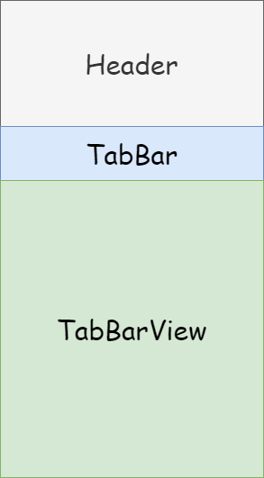
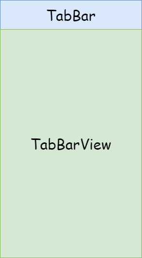

# 동적인 높이를 가진 SliverAppBar

> Flutter로 UI를 만들면서 많은 시행착오를 겪었던 **동적인 높이를 가진 SliverAppBar** 를 구현하는 방법을 정리했다.

## UI 설명

|                           기본 화면                            |                           스크롤 됐을 때                            |
| :------------------------------------------------------------: | :-----------------------------------------------------------------: |
|  |  |

구현하고자 하는 UI는 기본적으로 `Header`, `TabBar`, `TabBarView`가 모두 보이다가 아래로 스크롤 하면 `Header`가 사라지고, 다시 위로 스크롤 하면 `Header`가 나타나는 구조다.

## 기본적인 방법

```dart
Widget build(BuildContext context) {
  return NestedScrollView(
    headerSliverBuilder: (_, __) => [
      SliverAppBar(title: _Header()),
      _TabBar(), // SliverPersistentHeader를 이용하여 pinned를 true로 세팅해야 함
    ],
    body: _TabBarView(),
  );
}
```

`NestedScrollView`를 이용하면 원하는 UI를 어렵지 않게 구현할 수 있다.

## Header의 높이가 동적이라면?

`Header`를 감싸는 `SliverAppBar`는 `toolbarHeight` 속성으로 높이를 설정할 수 있는데 `Header`의 **높이**가 동적이라면 `Header`의 **높이**에 맞게 `toobarHeight` 속성을 지속적으로 변경해줘야 한다.

```dart

class MeasuredSize extends StatefulWidget {
  const MeasuredSize({
    Key? key,
    required this.onChanged,
    required this.child,
  }) : super(key: key);

  final ValueChanged<Size> onChanged;
  final Widget child;

  @override
  State<MeasuredSize> createState() => _MeasuredSizeState();
}

class _MeasuredSizeState extends State<MeasuredSize> {
  final widgetKey = GlobalKey();
  Size? oldSize;

  @override
  Widget build(BuildContext context) {
    SchedulerBinding.instance?.addPostFrameCallback(_postFrameCallback);

    return Container(
      key: widgetKey,
      child: widget.child,
    );
  }

  void _postFrameCallback(_) {
    var context = widgetKey.currentContext;
    if (context == null) return;

    final newSize = context.size;
    if (newSize == null || oldSize == newSize) return;

    oldSize = newSize;
    widget.onChanged(newSize);
  }
}
```

자식 위젯의 크기를 감지해 변경될 때마다 `onChanged(Size size)`를 호출하는 `MeasuredSize` 위젯을 정의했다.

```dart
class SomethingWidget extends StatefulWidget {
  const SomethingWidget({Key? key}) : super(key: key);

  @override
  _SomethingWidgetState createState() => _SomethingWidgetState();
}

class _SomethingWidgetState extends State<SomethingWidget> {
  double toolbarHeight = 0.0;

  @override
  Widget build(BuildContext context) {
    return NestedScrollView(
      headerSliverBuilder: (_, __) => [
        SliverAppBar(
          title: MeasuredSize(
            onChanged: (size) => setState(() => toolbarHeight = size.height),
            child: _Header(),
          ),
          toolbarHeight: toolbarHeight,
        ),
        _TabBar(),
      ],
      body: _TabBarView(),
    );
  }
}
```

앞서 정의한 `MeasuredSize` 위젯과 `StatefulWidget`의 `setState()`를 이용해서 동적인 `Header`의 **높이**를 `SliverAppBar`의 `toobarHeight`에 전달할 수 있다.

## 참고

- [How to get height of a Widget?](https://stackoverflow.com/questions/49307677/how-to-get-height-of-a-widget)
- [Measured-Size](https://github.com/ayham95/Measured-Size)
