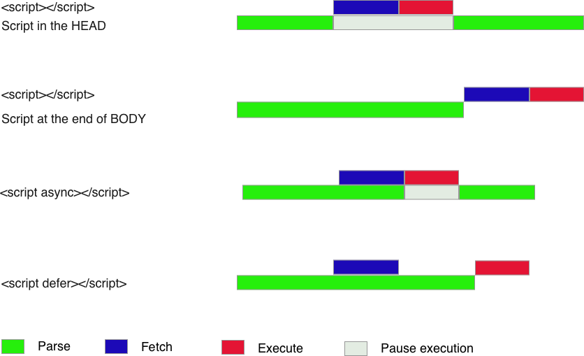

# `<script>` async, defer

> 브라우저는 기본적으로 html을 파싱하다가 `<script>` 태그를 만나면 스크립트 파일을 먼저 다운받고, 실행하게 된다. 이로 인한 문제점과 해결 방법을 알아보자.

---



스크립트를 불러오는 방법은 위 이미지와 같이 크게 4가지 방법이 있다.

## 기본적인 방법

```html
<html>
  <head>
    ...
    <script src="main.js"></script>
  </head>
  <body>
    ...
  </body>
</html>
```

브라우저가 위와 같은 코드를 만나면 최상단의 `<html>` 태그부터 차례대로 파싱하다가 `<script>` 태그를 만나면 파싱을 중단하고, 스크립트 파일을 다운받고 실행한 후에 다시 파싱을 진행한다.

이 방법은 크게 2개의 문제점이 있다.

- 스크립트를 다운받고 실행하는 동안 파싱이 중단되기 때문에 스크립트 파일이 크다면, 사용자가 웹사이트를 보기까지 오랜 시간이 소요될 수 있다.
- 스크립트에 DOM 요소를 조작하는 코드가 있다면 아직 html이 파싱되기 전이므로 기능이 정상적으로 동작하지 않을 수 있다.

## `<script>` 태그를 `<body>` 태그 마지막에 두는 방법

```html
<html>
  <head>
    ...
  </head>
  <body>
    ...
    <script src="main.js"></script>
  </body>
</html>
```

이 방법은 첫 번째 방법의 두 문제점을 해결한 것처럼 보이지만 html을 모두 파싱한 후에, 스크립트를 다운받고 실행하기 때문에 스크립트에 의존적인 웹사이트라면 웹사이트가 정상적으로 동작하기까지 역시 오랜 시간이 소요될 수 있다.

## async 속성

```html
<html>
  <head>
    ...
    <script async src="main.js"></script>
  </head>
  <body>
    ...
  </body>
</html>
```

async 속성을 이용하면 html을 파싱하는 동시에 스크립트를 다운받는다.

웹 사이트가 정상적으로 동작하기까지 시간이 앞의 두 방법보다는 단축되지만, html을 파싱하는 도중에 파싱을 중단하고 스크립트가 실행될 수 있기 때문에 DOM 요소를 조작하는 코드가 있다면 기능이 제대로 동작하지 않을 수 있다.

## defer 속성

```html
<html>
  <head>
    ...
    <script defer src="main.js"></script>
  </head>
  <body>
    ...
  </body>
</html>
```

defer 속성을 이용하면 html을 파싱하는 동시에 스크립트를 다운받고, html을 모두 파싱한 후에 스크립트를 실행한다.

async와 다르게 html 파싱을 모두 마친 후에 스크립트를 실행하기 때문에 DOM 요소를 조작하는 코드가 제대로 동작하지 않는 문제가 해결된다.

## 정리

- 별 다른 이유가 없다면 **defer**를 사용하자.
- 이 모든 것은 JS 파일이 작고, 사용자의 인터넷 환경도 좋다면 크게 문제가 되지 않지만, 반대로 JS 파일이 크고, 사용자의 인터넷 환경도 좋지 않다면 크게 문제가 될 수 있다. 항상 최악을 가정하고 프로그래밍 하자.

## 참조

- [Defer or Async?](https://javascriptanswers.com/defer-or-async/)
- [defer, async 스크립트](https://ko.javascript.info/script-async-defer)
